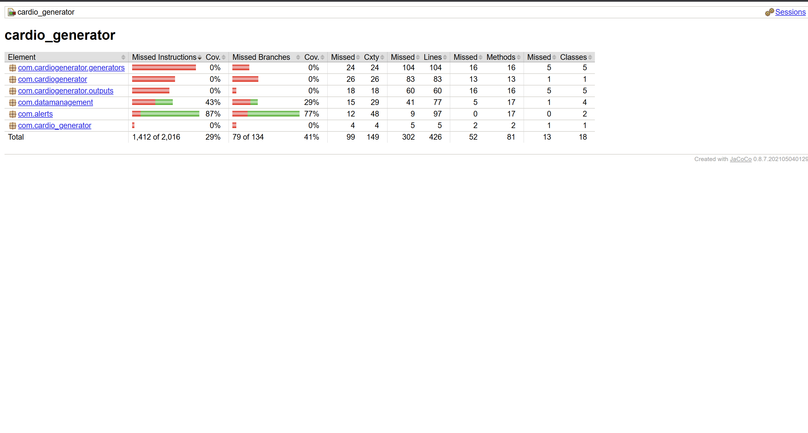

# Code Coverage Report

## Unit Test Verification
All 11 unit tests passed successfully.

## Coverage Report

## Description
The com.alerts package has 87% instruction coverage. Tests were written for all alert conditions including blood pressure trends, saturation drops, ECG peaks and triggered alerts. The com.datamanagement package has 43% coverage. FileDataReader was not tested because it reads from files on disk which makes it hard to unit test without setting up actual test files. 
